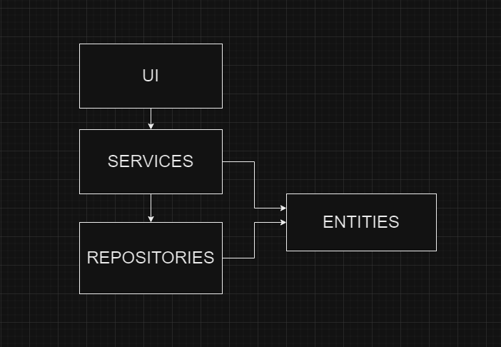
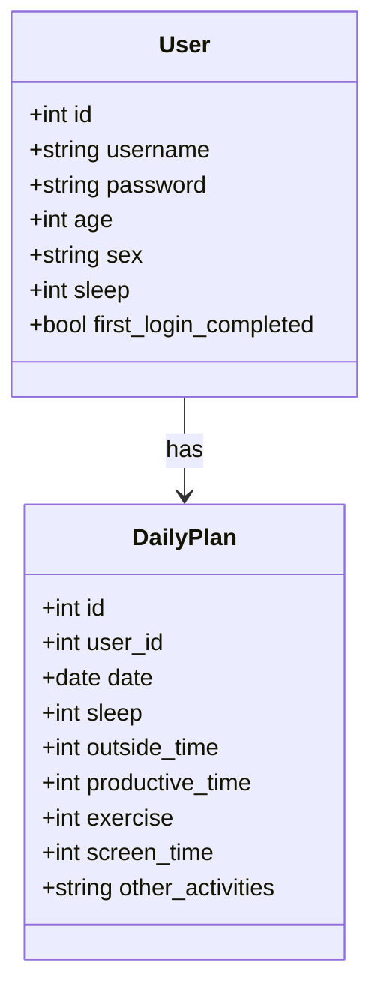
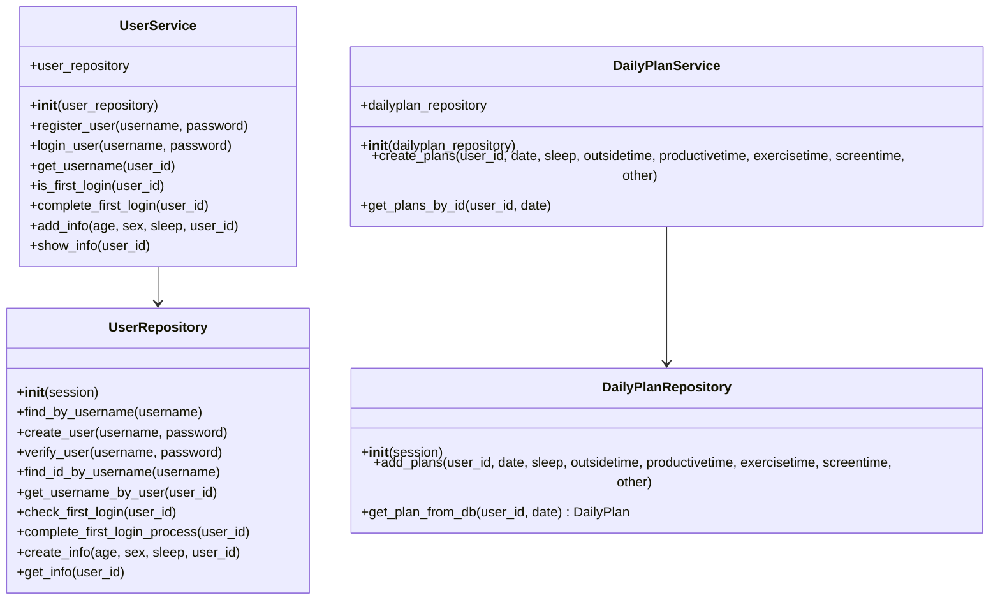

# Arkkitehtuurikuvaus

## Rakenne
Ohjelman pakkausrakenne koostuu, sqlalchemy malleista entities kansiossa, repositories kansiosta, josta tehdään tietokantaan liittyvät toiminnot,
services folderista, jossa on sovelluslogiikka ja UI kansiosta, jossa on frontend.

## Käyttöliittymä
Käyttöliittymässä on 8 näkymää
- Uuden käyttäjän luominen
- Kirjautuminen
- Daily planner näkymä
- Kalenteri näkymä
- Ensikyselyn näkymä
- Today view, eli päivän aktiviteettien näkymä
- User info view, eli omien tietojen näkymä.
- Advice view mistä näkee omia ehdotuksia.

Näkymillä on omat luokkansa, jotka kutsuvat dailyplanner ja user servicejä. 
Kun näkymää vaihdetaan kutsutaan views sanakirjaa, jossa on ui.py:ssä alusetetut näkymät. 

## Sovelluslogiikka
### Mallit 
[User](https://github.com/rigozu9/ot-harjoitustyo/blob/main/daily-planner-app/src/entities/user.py) ja [DailyPlan](https://github.com/rigozu9/ot-harjoitustyo/blob/main/daily-planner-app/src/entities/dailyplan.py) muodostavat sovelluksen mallit. User kuvaa käyttäjie ja dailyplan näiden käyttäjien päivittäisiä tekemisiä. 

### Sekvenssikaavio

### Services ja repositories
[UserService](https://github.com/rigozu9/ot-harjoitustyo/blob/main/daily-planner-app/src/services/user_service.py) ja [DailyPlanService](https://github.com/rigozu9/ot-harjoitustyo/blob/main/daily-planner-app/src/services/dailyplan_service.py) muodostavat sovelluksen logiikan.

[UserRepository](https://github.com/rigozu9/ot-harjoitustyo/blob/main/daily-planner-app/src/repositories/user_repository.py) ja [DailyPlanRepository](https://github.com/rigozu9/ot-harjoitustyo/blob/main/daily-planner-app/src/repositories/dailyplan_repository.py) muodostavat sovelluksen tietokannan tehtävät. 
### Sekvenssikaavio

## Tietokannan käyttö
Sovellus käyttää sqliteä tietokantana. Siellä on pöydät käyttäjille ja dailyplaneille. 
dailyplan_repository ja user_repository tekevät muutokset tietokantaan ja services kutsuu niitä.
Testien aikana laitetaan test env muuttuja päälle ja silloin käytetään eri tietokantaa kuin normaalisti sovelluksessa.