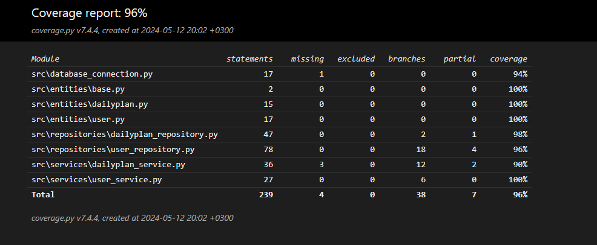

# Testausdokumentti

Ohjelmaa on testattu sekä automatisoiduin yksikkö- ja integraatiotestein unittestilla sekä manuaalisesti tapahtunein järjestelmätason testein.

## Yksikkö- ja integraatiotestaus

Sovelluslogiikan testeissä on 2 eri tiedostoa. Yksi [User](https://github.com/rigozu9/ot-harjoitustyo/blob/main/daily-planner-app/src/tests/user/test_user.py)-testiluokalla ja yksi [Dailyplan](https://github.com/rigozu9/ot-harjoitustyo/blob/main/daily-planner-app/src/tests/daily_planner/test_dailyplan.py)-testiluokalla. 

### Testauskattavuus

Testauksen haarautumakattavuus on %

<!--  -->

## Järjestelmätestaus ja asennus
Sovelluksen järjestelmätestaus on suoritettu manuaalisesti.

Sovellus on haettu ja sitä on testattu [käyttöohjeen](https://github.com/rigozu9/ot-harjoitustyo/blob/main/daily-planner-app/dokumentaatio/kayttoohje.md) kuvaamalla tavalla sekä windows- että Linux-ympäristöön.

### Toiminnallisuudet

Kaikki [määrittelydokumentin](https://github.com/rigozu9/ot-harjoitustyo/blob/main/daily-planner-app/dokumentaatio/vaatimusmaarittely.md) ja käyttöohjeen listaamat toiminnallisuudet on käyty läpi ja ne toimivat kuten pitääkin.