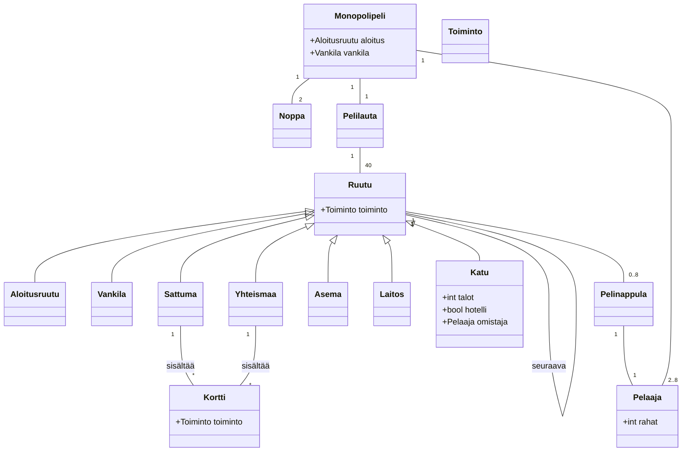

```mermaid
classDiagram
    class Monopolipeli {
      +Aloitusruutu aloitus
      +Vankila vankila
    }
    Monopolipeli "1" -- "2" Noppa
    Monopolipeli "1" -- "1" Pelilauta
    Pelilauta "1" -- "40" Ruutu
    class Ruutu {
      +Toiminto toiminto
    }
    Ruutu <|-- Aloitusruutu
    Ruutu <|-- Vankila
    Ruutu <|-- Sattuma
    Ruutu <|-- Yhteismaa
    Ruutu <|-- Asema
    Ruutu <|-- Laitos
    Ruutu <|-- Katu
    class Katu {
      +int talot
      +bool hotelli
      +Pelaaja omistaja
    }
    class Toiminto {
    }
    class Kortti {
      +Toiminto toiminto
    }
    Sattuma "1" -- "*" Kortti : sisältää
    Yhteismaa "1" -- "*" Kortti : sisältää
    Ruutu "1" -- "1" Ruutu : seuraava
    Ruutu "1" -- "0..8" Pelinappula
    Pelinappula "1" -- "1" Pelaaja
    class Pelaaja {
      +int rahat
    }
    Pelaaja "2..8" -- "1" Monopolipeli
```
