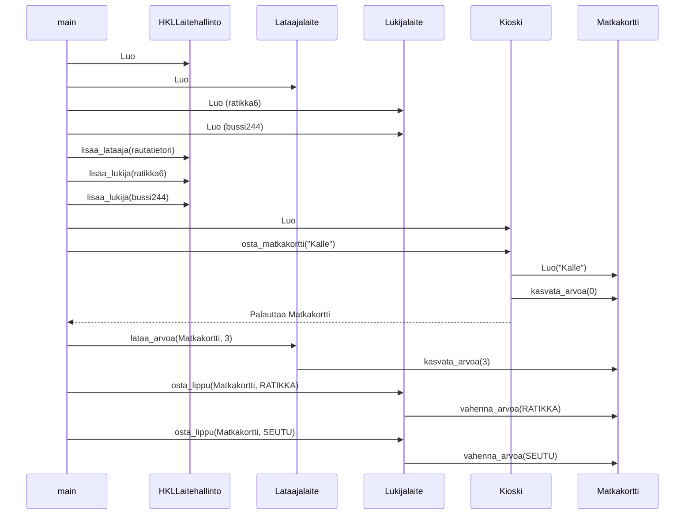

```mermaid
sequenceDiagram
    participant main
    participant HKLLaitehallinto as HKLLaitehallinto
    participant Lataajalaite as Lataajalaite
    participant Lukijalaite as Lukijalaite
    participant Kioski as Kioski
    participant Matkakortti as Matkakortti

    main->>HKLLaitehallinto: Luo
    main->>Lataajalaite: Luo
    main->>Lukijalaite: Luo (ratikka6)
    main->>Lukijalaite: Luo (bussi244)
    main->>HKLLaitehallinto: lisaa_lataaja(rautatietori)
    main->>HKLLaitehallinto: lisaa_lukija(ratikka6)
    main->>HKLLaitehallinto: lisaa_lukija(bussi244)
    main->>Kioski: Luo
    main->>Kioski: osta_matkakortti("Kalle")
    Kioski->>Matkakortti: Luo("Kalle")
    Kioski->>Matkakortti: kasvata_arvoa(0)
    Kioski-->>main: Palauttaa Matkakortti
    main->>Lataajalaite: lataa_arvoa(Matkakortti, 3)
    Lataajalaite->>Matkakortti: kasvata_arvoa(3)
    main->>Lukijalaite: osta_lippu(Matkakortti, RATIKKA)
    Lukijalaite->>Matkakortti: vahenna_arvoa(RATIKKA)
    main->>Lukijalaite: osta_lippu(Matkakortti, SEUTU)
    Lukijalaite->>Matkakortti: vahenna_arvoa(SEUTU)
```